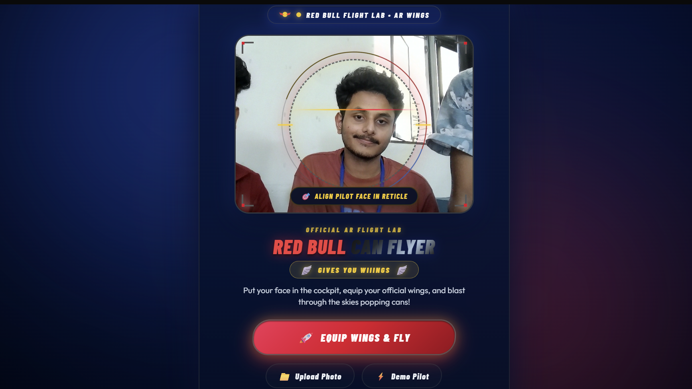
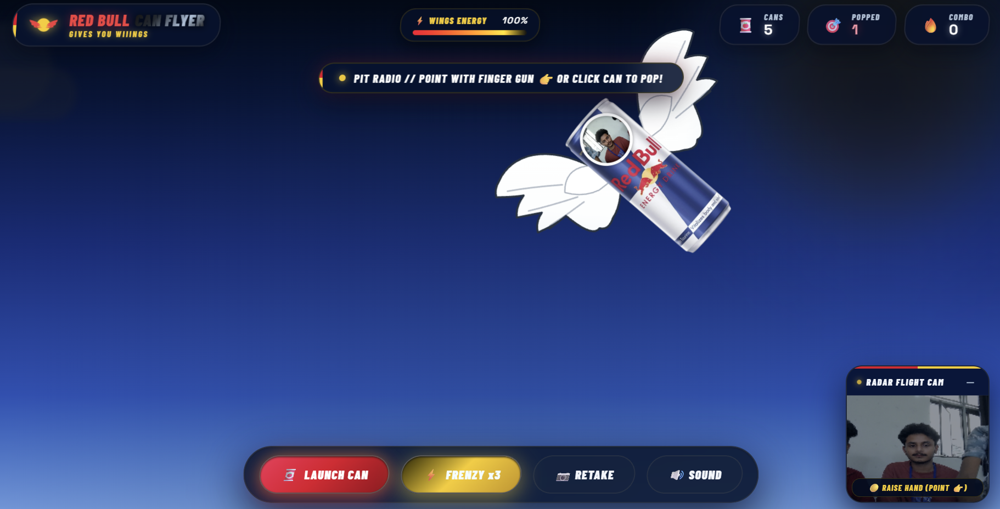
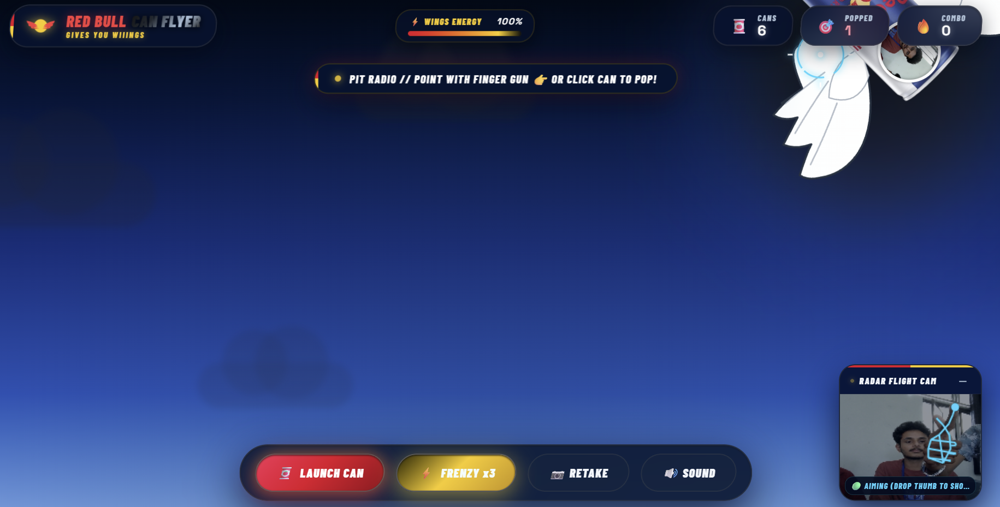

Red Bull Can Flyer — Gives You Wiiings 🪽🥫
Basic Details
Team Name: [Team GD]
Team Members
Team Lead: Dhyan Rajesh John 
Member 2: Goutham Krishna MM 
Project Description

Red Bull Can Flyer is a fast, fun AR web useless game where your face becomes the pilot inside an authentic Red Bull can equipped with cartoon wings. 🪽

Fly around and pop flying Red Bull cans by clicking them or using an AI-powered finger-gun camera gesture.

The Problem (that doesn't exist)

People have been facing a serious problem:

What if a Red Bull can could fly... but nobody had a way to stop it? 🥫🪽

There is absolutely no practical reason to solve this problem, but somebody had to do it.

The Solution (that nobody asked for)

We turned a Red Bull can into a flying vehicle and put your face inside it.

The game uses your webcam to capture your face and lets you become the pilot. Flying cans appear in the game, and you can pop them using:

🖱️ Mouse/touch clicking
👉 AI finger-gun aiming
💥 Thumb-drop laser shooting
🚀 Launch Can button
⚡ Frenzy x3 mode for maximum uselessness

Basically, we created a solution to a problem that never existed.

Technical Details
Technologies/Components Used

For Software:

HTML
CSS
JavaScript
Vanilla Web Technologies
MediaPipe Hand Landmarker / Hand Landmarks Detection
HTML Canvas API
Web Camera API
Web Audio API

Frameworks:

No frameworks — Pure Vanilla HTML, CSS & JavaScript

Hardware:

No dedicated hardware required
Webcam/camera optional
Runs directly in a modern web browser
Implementation

For Software:

The project is divided into multiple modules:

CAN FLYER/
├── index.html
├── css/
│   ├── style.css
│   ├── camera.css
│   └── game.css
├── js/
│   ├── main.js
│   ├── game.js
│   ├── cans.js
│   ├── handTracker.js
│   ├── camera.js
│   ├── effects.js
│   └── audio.js
├── assets/
│   ├── rbc.png
│   └── rbv.mp3
└── README.md
Installation

Clone the repository:

git clone https://github.com/Gouthamplayz/useless_project_temp.git

Move into the project folder:

cd useless_project_temp

The project does not require any additional framework or build system.

Run

Because the project uses browser features such as the webcam, run it using a local server or host it using GitHub Pages.

For example, using VS Code:

Open the project folder.
Install the Live Server extension.
Right-click index.html.
Select Open with Live Server.
Open the displayed browser URL.
Allow camera access when prompted.
Project Documentation
Screenshots

Main landing screen showing the Red Bull Can Flyer interface.

Pilot scanner screen where the user captures or uploads their face.

Flight arena showing flying cans, HUD telemetry and gameplay controls.

Diagrams

Project workflow showing camera input, face capture, hand tracking, game logic and flying-can interaction.

Project Demo
Video

The demo demonstrates pilot setup, flying-can gameplay, mouse interaction and AI finger-gun controls.

Additional Demos

🌐 Live Website:
https://gouthamplayz.github.io/Red-Bull-Can-Flyer/

💻 GitHub Repository:
https://github.com/Gouthamplayz/useless_project_temp

Team Contributions
Dhyan Rajesh John: Game concept, UI/UX design, gameplay development and project integration.
Goutham Krishna MM: Web development, camera integration, hand-tracking functionality and game mechanics.

Made with ❤️ at TinkerHub Useless Projects

